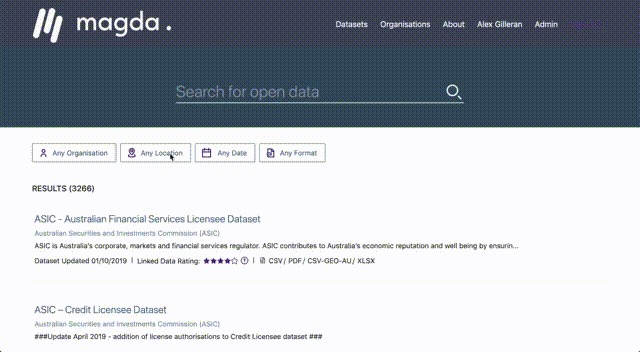

# Magda

Magda is a data catalog system that provides a single place where all of an organization's data can be catalogued, enriched, searched, tracked and prioritized - whether big or small, internally or externally sourced, available as files, databases or APIs. Magda is designed specifically around the concept of _federation_ - providing a single view across all data of interest to a user, regardless of where the data is stored or where it was sourced from. The system is able to quickly crawl external data sources, track changes, make automatic enhancements and push notifications when changes occur, giving data users a one-stop shop to discover all the data that's available to them.

## Features

-   A heavily automated, quick and easy to use data cataloguing process intended to produce high-quality metadata for discovery
-   Powerful and scalable search based on ElasticSearch
-   Quick and reliable aggregation of external sources of datasets
-   An unopinionated central store of metadata, able to cater for most metadata schemas
-   Federated authentication via passport.js - log in via Google, Facebook, WSFed, AAF, CKAN, and easily create new providers.
-   Easy, one-step (or close to) installation and upgrades
-   Based on Kubernetes for cloud agnosticism - deployable nearly any cloud, or on-premises.
-   Extensions are based on adding new docker images to the cluster, and hence can be developed in any language

### Currently Under Development

-   A robust, policy-based authorization system built on Open Policy Agent - write flexible policies to restrict access to datasets and have them work across the system, including by restricting search results to what you're allowed to see.
-   Refinements to the data catalog
-   Storage of datasets
-   Deduplication of datasets, without necessarily storing the underlying data

Our current roadmap is available at https://magda.io/docs/roadmap

## Architecture

Magda is built around a collection of microservices that are distributed as docker containers. This was done to provide easy extensibility - Magda can be customised by simply adding new services using any technology as docker images, and integrating them with the rest of the system via stable HTTP APIs. Using Helm and Kubernetes for orchestration means that configuration of a customised Magda instance can be stored and tracked as plain text, and instances with identical configuration can be quickly and easily reproduced.

### Registry

Magda revolves around the _Registry_ - an unopinionated datastore built on top of Postgres. The Registry stores _records_ as a set of JSON documents called _aspects_. For instance, a dataset is represented as a record with a number of aspects - a basic one that records the name, description and so on as well as more esoteric ones that might not be present for every dataset, like temporal coverage or determined data quality. Likewise, distributions (the actual data files, or URLs linking to them) are also modelled as records, with their own sets of aspects covering both basic metadata once again, as well as more specific aspects like whether the URL to the file worked when last tested.

Most importantly, aspects are able to be declared dynamically by other services by simply making a call with a name, description and JSON schema. This means that if you have a requirement to store extra information about a dataset or distribution you can easily do so by declaring your own aspect. Because the system isn't opinionated about what a record is beyond a set of aspects, you can also use this to add new entities to the system that link together - for instance, we've used this to store projects with a name and description that link to a number of datasets.

### Connectors

Connectors go out to external datasources and copy their metadata into the Registry, so that they can be searched and have other aspects attached to them. A connector is simply a docker-based microservice that is invoked as a [job](https://kubernetes.io/docs/concepts/workloads/controllers/jobs-run-to-completion/). It scans the target datasource (usually an open-data portal), then completes and shuts down. We have connectors for a number of existing open data formats, otherwise you can easily write and run your own.

### Minions

A minion is a service that listens for new records or changes to existing records, performs some kind of operation and then writes the result back to the registry. For instance, we have a broken link minion that listens for changes to distributions, retrieves the URLs described, records whether they were able to be accessed successfully and then writes that back to the registry in its own aspect.

Other aspects exist that are written to by many minions - for instance, we have a "quality" aspect that contains a number of different quality ratings from different sources, which are averaged out and used by search.

### Search

Datasets and distributions in the registry are ingested into an ElasticSearch cluster, which indexes a few core aspects of each and exposes an API.

### User Interface

Magda provides a user interface, which is served from its own microservice and consumes the APIs. We're planning to make the UI itself extensible with plugins at some point in the future.

## To try the last version (with prebuilt images)

Use https://github.com/magda-io/magda-config

## To build and run from source

https://magda.io/docs/building-and-running

## To get help with developing or running Magda

Talk to us on Gitter!

## Want to get help deploying it into your organisation?

Email us at contact@magda.io.

## Want to contribute?

Great! Take a look at https://github.com/magda-io/magda/blob/master/.github/CONTRIBUTING.md :).
