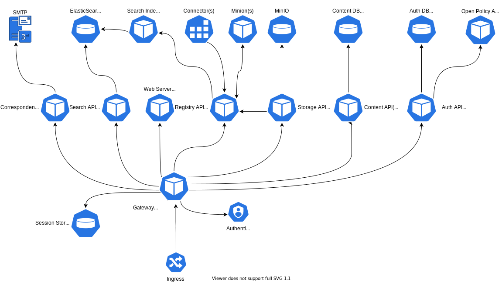
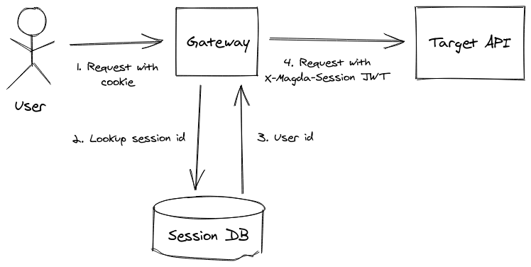
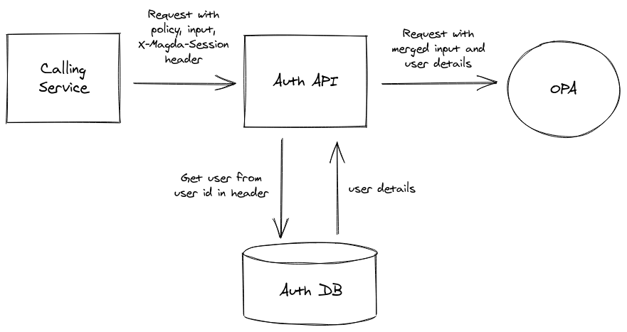
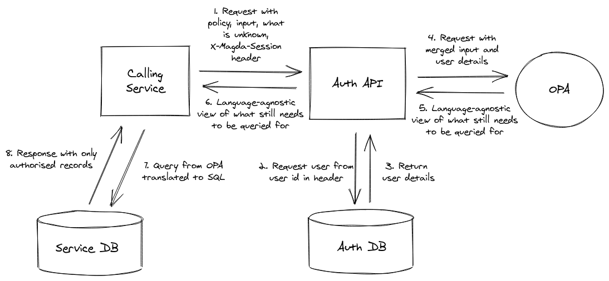

Guide to Magda Internals

# Guide to Magda Internals

[[toc]]

# Architecture Diagram

# Components

As a microservices-based system, Magda consists of a number of individual parts. What follows is a description of the responsibility and capabilities of each, in rough alphabetical order.

## Authorization API

The Authorization API has a few responsibilities that also touch on authentication as well (possibly this deserves a refactoring!). It is responsible for:

-   Storing what we know about users
-   Determining what a user is allowed to do
-   Storing the details of Magda's non-federated authentication - e.g. internal Magda passwords and API keys

To make this happen, the Auth API has both its own database and a connection to [Open Policy Agent (OPA)](https://www.openpolicyagent.org/). It wraps an API around OPA that allows it to be called with just a JWT identifying the current user, and automatically passes in the user's details in the format expected by the OPA policies. See [Authorization](#authorization-authz) for more details about how Magda's authn system works.

## Connectors

Connectors are responsible for bringing in data from other sources on a one-time or regular basis. Connectors go out to external datasources and copy their metadata into the Registry, so that they can be searched and have other aspects attached to them. A connector is simply a docker-based microservice that is invoked as a job. It scans the target datasource (usually an open-data portal), then completes and shuts down. We have connectors for a number of existing open data formats, otherwise you can easily write and run your own.

## Content API

The Content API is responsible for everything to do with _content_ - that is, what a user sees and interacts with (as opposed to an admin, or another service within the system). Ideally this would mean that all text seen by a user was managed by the Content API, but in practice only a small amount is, the rest is sadly baked into the UI at this point.

The Content API is like a very very light headless CMS, used by Magda to hold text and files around content - e.g. the text for certain pages, and certain configurable images like logos. Content can be retrieved by ID, or by querying - e.g. the Magda UI makes a query for anything that affects the header or the footer when it does its initial render, and uses the result to determine what should be in those components.

The Content API was created a long time before the Storage API, and hence stores files in its database by base64ing them and putting them in a table - there's possibly an opportunity to use the Storage API for this instead.

## Correspondence API

The Correspondence API is responsible for sending messages to users (_not_ sending them to machines). In practice this currently just means sending emails based on requests from the UI, but it could potentially also take into account other messaging mediums like SMS or push notifications, and other classes of message like notifications about something changing in the system.

Currently the Correspondence API is used to send questions about datasets to the dataset contact point, and send direct questions to the Magda admin email address. In order to route a question to the dataset contact point, it grabs the contact point information from the `dcat-dataset-strings` aspect in the registry and if it can find something that looks like an email in there, it'll use that as the recipient - otherwise it falls back to the default Magda email address.

Email templates are stored in the Content API. The Correspondence API gets the information it needs, passes that information into a template, then uses a configured SMTP server to send out emails. Usually we end up using Mailgun.

## Gateway

The Gateway is responsible for:

-   Proxying requests from outside Magda to the correct service
-   Authenticating users when they sign in
-   Authenticating (not authorising) requests, according to the supplied auth cookie or API key
-   Maintaining sessions

## Minions

A minion is a service that listens for new records or changes to existing records, performs some kind of operation and then writes the result back to the registry. For instance, we have a broken link minion that listens for changes to distributions, retrieves the URLs described, records whether they were able to be accessed successfully and then writes that back to the registry in its own aspect. Minions don't currently really have a responsibility within the system - their responsibility depends on what they're designed to do, which varies.

Other aspects exist that are written to by many minions - for instance, we have a "quality" aspect that contains a number of different quality ratings from different sources, which are averaged out and used by search.

## Registry

The Registry is responsible for:

-   Storing and being the source of truth for the metadata managed by Magda
-   Letting other services know about changes to this metadata

### Records

Everything in the registry, regardless of what it is, is represented as a “record” in the registry - think of it as a similar concept to a row in a database table, or an object in Object-Oriented Programming. Datasets are records, distributions are records, organisations are records, etc.

### Aspects

A record by itself has only an id and a name attached to it. All other metadata sits within “aspects”, instances of which are attached to records.

An aspect is like a class in OOP - it defines how a certain part of a record should look. A record will have instances of a number of aspects - e.g. a dataset might have an aspect to describe its basic metadata (dcat-dataset-strings), another one to describe its currency (currency), and another one to keep track of its sync status with an external ckan repository (ckan-export).

This means that what a record represents isn’t static - it can be changed and added to over time by adding or removing aspects. For example, a record representing a dataset harvested from an external portal might start with a dcat-dataset-strings aspect, but you might want to define your own aspect definition, and then add your own complementary metadata to it.

An aspect consists of an id, a name and a JSON schema, which is used to validate new data as its added.Aspects are able to be declared dynamically by other services by simply making a `PUT` or `POST` call with these details. This means that if you have a requirement to store extra information about a dataset or distribution you can easily do so by declaring your own aspect. Because the system isn't opinionated about what a record is beyond a set of aspects, you can also use this to add new entities to the system that link together - for instance, we've used this to store projects with a name and description that link to a number of datasets.

### Record-Aspects

A record is stored as a set of aspects attached to that record. For instance, a dataset might have a a basic one that records the name, description and so on as well as more esoteric ones that might not be present for every dataset, like temporal coverage or determined data quality. Likewise, distributions (the actual data files, or URLs linking to them) are also modelled as records, with their own sets of aspects covering both basic metadata once again, as well as more specific aspects like whether the URL to the file worked when last tested. These are recorded in the Registry database as "recordaspects" - an instance of an aspect that's attached to a record.

### Events

An event is generated any time something changes in the Registry - generally when a record, aspect or record-aspect is:

-   Created
-   Deleted
-   Modified

Events that record a modification generally record a JSON patch that details what changed inside that entity. Events can be used to track the history of an entity over time, or to reconstruct that entity at a certain time and see what it used to be.

### Webhooks

Webhooks allow services outside the registry (and potentially outside the Magda instance itself, eventually) to be notified of events occurring within the registry, as they occur. A webhook is registered by calling `POST` and specifying what event type(s) are to be listened for, and what aspects are to be listened for, and a URL to call with the event payload. After the webhook is created, the registry will call that URL whenever an event matching the recorded query changes.

For instance, the search indexer keeps the ElasticSearch index up to date by subscribing to nearly every event type that has to do with the `dcat-dataset-strings`, `dataset-distributions` and a few other aspects. When any dataset record is added, deleted or modified in the registry, a webhook is sent to the indexer with details of the change and an up-to-date version of the record, which the indexer either ingests or deletes depending on the event type.

## Search API

The responsibility of the Search API is to provide as powerful of a search function as possible, primarily for datasets and a few other objects (publishers, regions).

It's implemented as a wrapper around ElasticSearch, and allows for searching of datasets, publishers and regions. Note that unlike the Registry, the Search API does not have the same open, schema-less, unopinionated design regarding what it stores and how it stores it - the Search API is specifically designed to search for certain objects like datasets, and has a separate endpoint for each object type.

## Search Indexer

The responsibility of the Search Indexer is to:

-   Set up the ElasticSearch index definitions
-   Put relevant information (datasets, publishers etc) into the ElasticSearch index, so that the [Search API](#search-api) can get it out later.
-   Make other changes to the ElasticSearch index that enable search - e.g. putting regions in so that they can be used for spatial search, loading in the Wordnet synonyms dataset etc.

The Search Indexer is always trying to make sure that the datasets stored in the search index matches what's in the Registry's database - this means both responding to Webhook events and doing an initial load of all the datasets in the registry both the first time Magda is run, and whenever the index definition is changed.

On first startup, the Indexer will also try to set up the regions index - at the moment this only knows how to pull in GeoJSON files of ABS regions from the Terria AWS account's S3 and (slowly) load them in. Currently if this is interrupted it won't be retried unless the entire regions index is deleted :(.

The index definitions used by the Indexer change over time - within the code itself there are index definitions, and these have an integer describing their version. When the indexer starts up, it'll check for the existence of an index with its current version - if it can't find one, it'll create it and start populating it. Because the version to look at can be seperately specified in the Search API, this means that you can have the indexer working on setting up `datasets41`, for instance, while the Search API is still querying against version `datasets40`.

## Storage API

The Storage API is responsible for storing and retrieving files, and applying authorization to those operations.

It acts as a wrapper around [MinIO](https://min.io/), which in turn allows it to be backed by a stateful set or other storage solutions like S3 or Google Storage.

Currently it has a rudimentary authorization mechanism that allows files to be linked to the id of a record in the Registry - only if the requesting user is allowed to see that record are they allowed to download the file. This allows file downloads to be protected in a way that matches record authorization in the Registry.

## Web Server

The web server responsible for serving the files (HTML/JS/CSS) needed to render the front-end, and for passing configuration to the web application. Note that the server logic is specified in the `magda-web-server` directory, but the client-side logic is in `magda-web-client`, which is incorporated into the web server docker image at build time.

# Authentication (authn)

## Internal Requests

For requests between pods within Magda, HTTP requests are authenticated by passing a JWT in the `X-Magda-Session` header, which contains at least `userId` as a claim (but could potentially contain more information). The `userId` claim must be the id of a user that can be looked up using the Auth API, and must be signed using a shared JWT secret that's passed to pods via Kubernetes.

Making a request within Magda with no `X-Magda-Session` is also valid - these are treated as being unauthenticated - i.e. they don't come from a particular user. E.g. this is the case for most requests through data.gov.au, where nearly no one signs in.

## External Requests

For requests that come from outside Magda, authentication is applied at the Gateway, with the help of the [NodeJS Passport library](http://www.passportjs.org/).

Currently an external request can be authenticated in two ways:

### Session Cookie

Magda uses [express-session](https://www.npmjs.com/package/express-session) to manage session-based authentication. When a user signs in (via an endpoint in the gateway, that's called from the front-end), it attaches a cookie to the response that contains a session id, and a session is recorded in the Session DB against it that contains the user id. When subsequent requests come in with that cookie, the gateway will look up the session id, and if it's both valid and unexpired it will get the user id and forward the request to the appropriate internal API with an `X-Magda-Session` header attached (see _Internal Requests_ above) containing that user id.

In this way, only the gateway needs to know that external requests even exist - all other services in Magda can treat internal and external requests identically.

### API Key

Recently Magda has added the ability to authenticate via an API Key rather than logging in - this makes it much easier when trying to use the Magda API from code rather than from a browser.

API Keys are created up-front - one user can have zero-to-many API Keys associated with it. An API Key consists of an ID, and the key itself. Currently they're created via the `yarn create-api-key` script, until some kind of control panel functionality to create them is built.

If the request provides `X-Magda-API-Key` and `X-Magda-API-Key-Id` headers, these will be looked up in the Auth API, and if valid, then the request will be forwarded with an `X-Magda-Session` JWT with the user id associated with that API Key.

# Authorization (authz)

## Legacy System

The authorization system within Magda is very much a work in progress. For most of the project's history, the authz system has boiled down to a boolean: either a user is an admin, or is not an admin, as specified by a value in the users table of the Auth DB. If the user is an admin they can do essentially anything in the system, if the user is _not_ an admin they don't have the ability to make any changes to the system. Magda has been able to get away with having such a simple mechanism in place for quite a while, because for its original data.gov.au use-case nearly every user had the access to view anything and change nothing.

## Future System

Going forward, we want to move to a policy-based authorization system via [Open Policy Agent (OPA)](https://www.openpolicyagent.org/). At the time of writing, this is partially implemented - mostly inside the Registry API.

OPA allows for a _policy_ to be specified to determine whether a specific action should be allowed or denied. These policies are written in OPA's prolog-esque domain-specific-language _Rego_, and can be changed at runtime if necessary.

Evaluating these policies can be accomplished in a number of ways, but the way we do it in Magda is by operating OPA as a RESTful server. The Auth API sits in front of OPA, takes in requests with `X-Magda-Session`, looks up the appropriate user and combines that with other inputs passed in when making the request to OPA's REST API.

### Simple Queries

For simple authorization queries where a service within Magda simply needs to know whether something is allowed or not allowed, the relevant policy can be directly queried, passed what it needs to know and a yes/no answer returned.

### Partial Evaluation

OPA also has the ability to do _partial evaluation_. If you want to query some kind of collection but the user is only allowed to see some records in that collection, you can effectively ask OPA "what should I put in a query to only return what the user is allowed to see".

E.g.

### How it works in the Registry API

# Deployment

# Architectural Decisions

## Macro

### Why Microservices?

### Why Kubernetes?

### Why Scala?

### Why Node.js?

### Why ElasticSearch?

## Front-end

### Why a Single Page Application, and why Create React App?

## Authn/z

### Why not just store the user id in a JWT and get rid of the session db entirely?

That would work too, but this way we can invalidate sessions whenever we want - see [this blog post](https://developer.okta.com/blog/2017/08/17/why-jwts-suck-as-session-tokens).

### Why only pass the user id, why not all details about the user?

### Why not conventional RBAC/ABAC?
