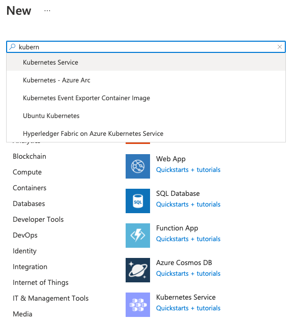

# Deploy Magda to Microsoft Azure

1> Install the Azure CLI

If you haven't, follow the link below to install the Azure CLI.

https://docs.microsoft.com/en-us/cli/azure/install-azure-cli

2> In Azure Portal, create a [Resource Group](https://docs.microsoft.com/en-us/azure/azure-resource-manager/management/overview) with a name you preferred. e.g. `magda-deploy-res-group`.

> A `Resource Group` is a container that holds related resources for an Azure solution.

3> Go the resource group created, click "Add" button to add "Kubernetes Service". If it is not already on the screen, you can find it from search input by key in "Kubernetes Service". See screenshot below:



4> Open the "Kubernetes Service" resource that is just created (see screenshot below).

And click the "Connect" button to get the commands required to connect to your cluster and setup the k8s config for your local kubectl tool.


5> Install kubernetes-replicator

> It’s only required by the OpenFaas part of Magda which can be turned off via [global.openfaas.enabled](https://github.com/magda-io/magda/tree/master/deploy/helm/magda).

```bash
# add helm chart repo
helm repo add mittwald https://helm.mittwald.de

# update helm chart repo
helm repo update

# create namespace `kubernetes-replicator`
kubectl create namespace kubernetes-replicator

# Install kubernetes-replicator via helm
helm upgrade --namespace kubernetes-replicator --install kubernetes-replicator mittwald/kubernetes-replicator
```

6> Create a namespace "magda" for your Magda installation

```bash
kubectl create namespace magda
```

7> Create required secrets

> You need [pwgen](https://linux.die.net/man/1/pwgen) command line tool to follow the instruction below. If it's not availble on nyour system, you need to install one.

```bash
export JWT_SECRET="$(pwgen 32 1)"
export SESSION_SECRET="$(pwgen 32 1)"
export DB_PASSWORD="$(pwgen 32 1)"
export MINIO_ACCESS_KEY="$(pwgen 32 1)"
export MINIO_SECRET_KEY="$(pwgen 32 1)"

kubectl create secret generic auth-secrets --namespace magda --from-literal=jwt-secret=$JWT_SECRET --from-literal=session-secret=$SESSION_SECRET

kubectl --namespace magda annotate --overwrite secret auth-secrets replicator.v1.mittwald.de/replication-allowed=true replicator.v1.mittwald.de/replication-allowed-namespaces=magda-openfaas-fn

kubectl create secret generic db-passwords --namespace magda \
--from-literal=combined-db=$DB_PASSWORD \
--from-literal=authorization-db=$DB_PASSWORD \
--from-literal=content-db=$DB_PASSWORD \
--from-literal=session-db=$DB_PASSWORD  \
--from-literal=registry-db=$DB_PASSWORD \
--from-literal=combined-db-client=$DB_PASSWORD \
--from-literal=authorization-db-client=$DB_PASSWORD \
--from-literal=content-db-client=$DB_PASSWORD \
--from-literal=session-db-client=$DB_PASSWORD \
--from-literal=registry-db-client=$DB_PASSWORD \
--from-literal=tenant-db=$DB_PASSWORD \
--from-literal=tenant-db-client=$DB_PASSWORD

kubectl create secret generic storage-secrets --namespace magda --from-literal=accesskey=$MINIO_ACCESS_KEY --from-literal=secretkey=$MINIO_SECRET_KEY

# Optional; Only for sending email notification of user inquires
kubectl create secret generic smtp-secret --namespace magda --from-literal=username=$SMTP_USERNAME --from-literal=password=$SMTP_PASSWORD
```

8> Add Magda Helm Repo

```bash
helm repo add magda-io https://charts.magda.io
helm repo update
```

9> Install Magda via Helm

```bash
helm upgrade --namespace magda --install --timeout 9999s --set magda-core.gateway.service.type=LoadBalancer magda magda-io/magda
```

> By default, Helm will install the latest production version of Magda. You can use `--version` to specify the exact chart version to use. e.g.:

```bash
helm upgrade --namespace magda --install --version 0.0.60-rc1 --timeout 9999s --set magda-core.gateway.service.type=LoadBalancer magda magda-io/magda
```

The value `--set magda-core.gateway.service.type=LoadBalancer` will expose Magda via load balancer.

You can run:

```bash
echo $(kubectl get svc --namespace magda gateway --template "{{ range (index .status.loadBalancer.ingress 0) }}{{ . }}{{ end }}")
```

to find out the load balancer external IP. And access Magda via http://[External IP].

> To expose Magda via Ingress and Setup TLS / SSL, you can follow [this docs](https://docs.microsoft.com/en-us/azure/aks/ingress-tls)
